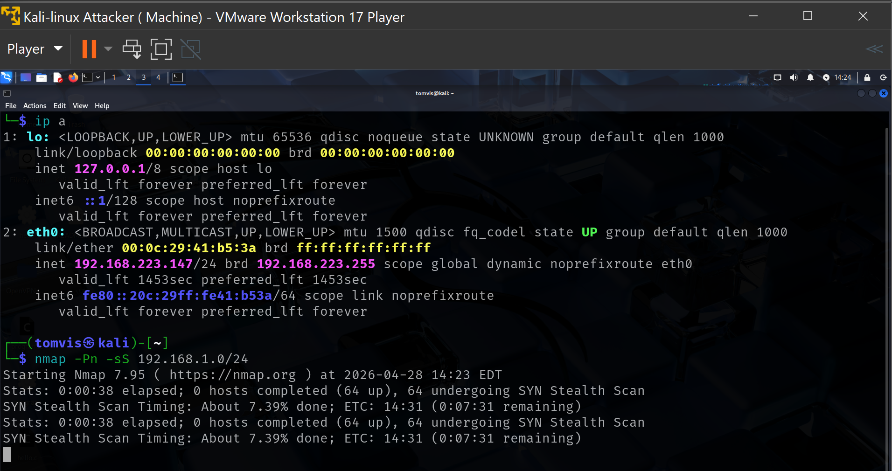
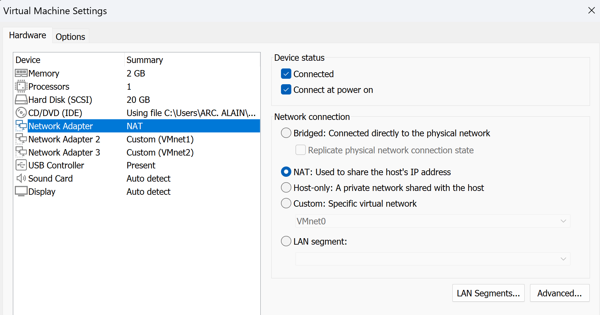
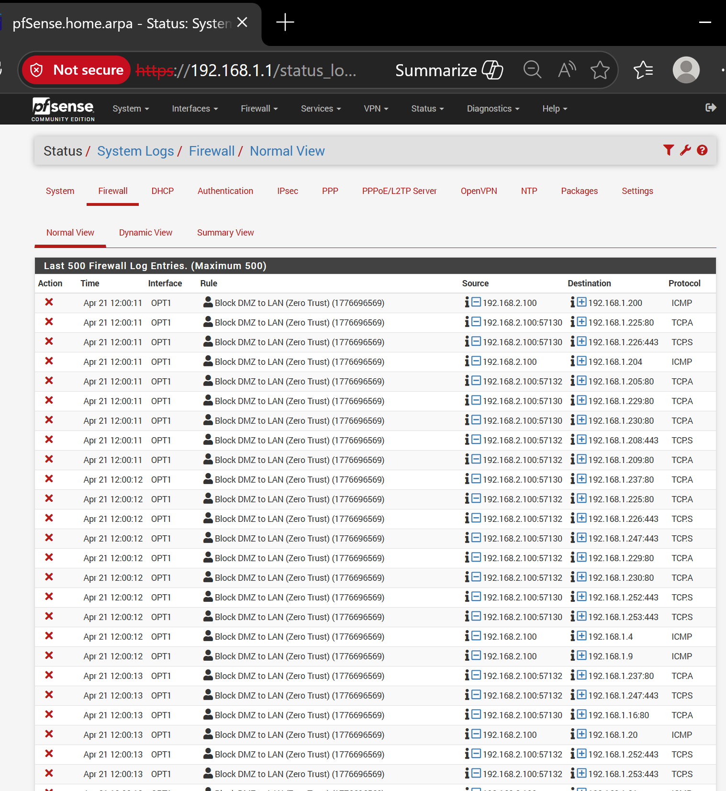
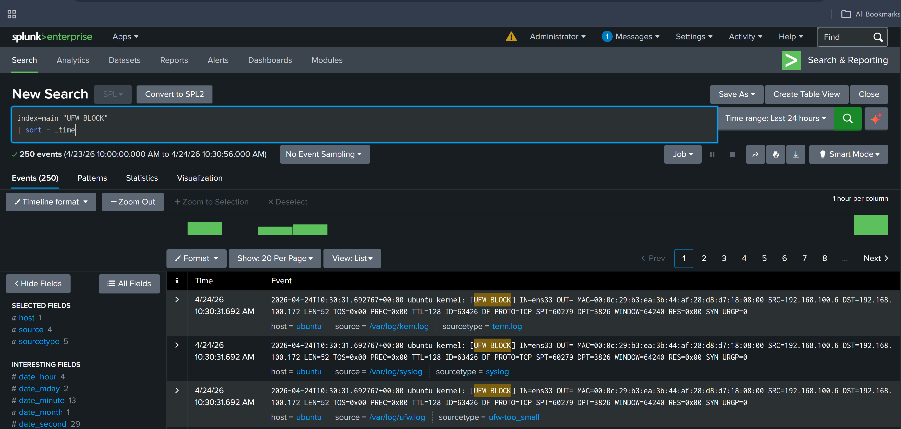
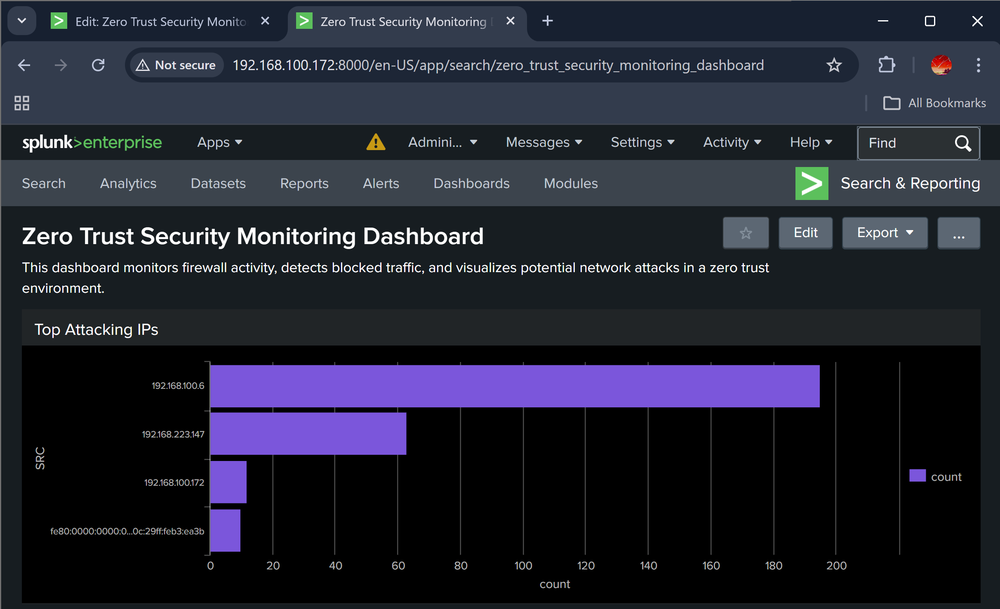

# 🔐 Zero Trust SOC Lab with Splunk, pfSense & Kali

## 📌 Overview

This project demonstrates a **Zero Trust Security Architecture** with real attack simulation and detection using **Splunk SIEM**.

The lab simulates an attacker attempting to access a protected network, while firewall rules and monitoring tools detect and block malicious activity.

---

## 🎯 Objectives

* Simulate network attacks using Kali Linux
* Implement Zero Trust segmentation with pfSense
* Detect malicious activity using Splunk SIEM
* Create dashboards and alerts
* Produce an incident report

---

## 🧱 Lab Architecture

* Kali Linux (Attacker)
* pfSense Firewall (Zero Trust enforcement)
* Ubuntu (Splunk SIEM)
* Segmented networks (LAN, DMZ)

---

## 🔥 Attack & Defense Flow (SOC Storytelling)

1. Attack initiated from Kali Linux
2. Network segmented using VMware
3. DMZ created in pfSense
4. Firewall rules enforce Zero Trust
5. Attack detected in logs (Splunk & pfSense)
6. Attack blocked (firewall evidence)
7. Summary dashboard visualizes activity

---

## 📸 Key Evidence

### 🔴 Attack Simulation (Kali)



### 🟡 Network Segmentation (VMware)



### 🔵 Firewall Rules (Zero Trust)

.png)

### 🚫 Blocked Traffic Logs (pfSense)



### 📊 Summary Dashboard (pfSense)


### 🧠 Splunk Detection



### 📊 Splunk Dashboard



---

## 🔍 Detection Logic (Splunk)

```spl
index=main "UFW BLOCK"
| stats count as blocked_attempts by SRC
| where blocked_attempts > 20
| sort -blocked_attempts
```

---

## 🚨 Features

* Zero Trust Network Design
* Firewall rule enforcement
* Attack detection and logging
* SIEM monitoring (Splunk)
* Dashboard visualization
* Incident reporting

---

## 🧠 MITRE ATT&CK Mapping

* T1595 – Active Scanning
* T1110 – Brute Force

---

## 📄 Incident Report

See:
`Reports/incident-report.pdf`

---

## 🏁 Conclusion

This project demonstrates hands-on experience in:

* Security monitoring (SOC Level 1)
* Threat detection and analysis
* Network segmentation (Zero Trust)
* SIEM usage (Splunk)
* Incident response documentation

---

## 🚀 Skills Demonstrated

* Splunk (SIEM)
* pfSense (Firewall)
* Nmap (Scanning)
* Network Security
* Log Analysis
* Incident Response
* Zero Trust Architecture

